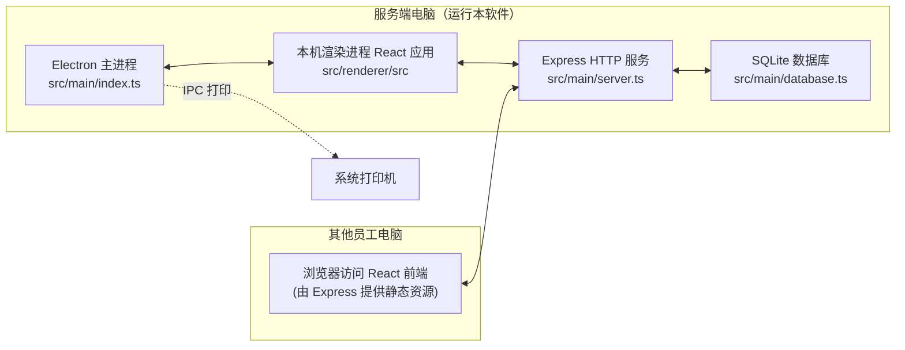
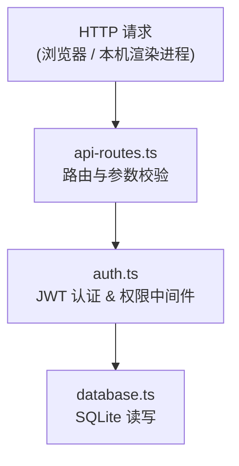
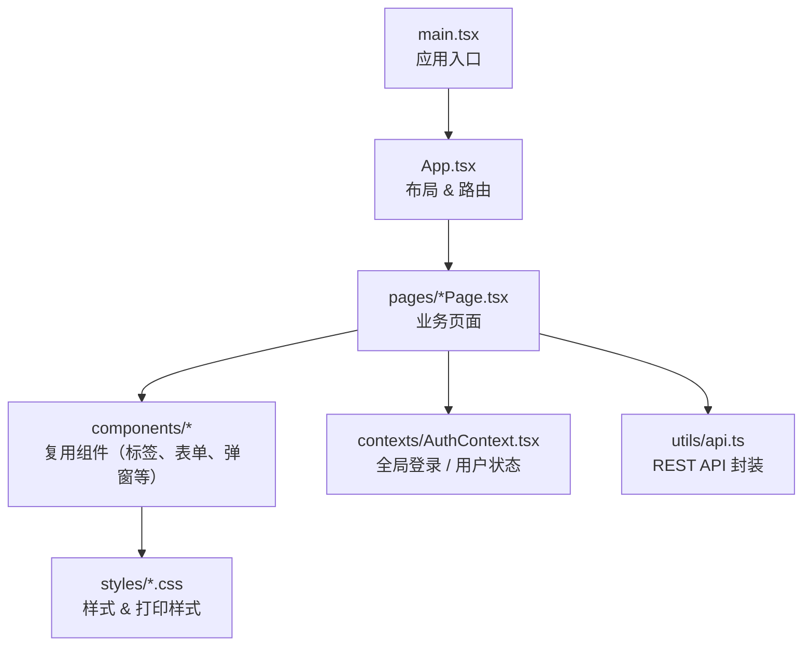

# 库存管理系统 (Inventory Management)

一款基于 Electron 的桌面端库存管理与标签打印软件，内置 Express HTTP 服务器，支持多用户协同使用。一台电脑作为服务端运行软件，其他员工通过浏览器访问，无需安装任何软件。

## 项目介绍（背景与目的）

### 项目背景

在实际仓储与生产协同场景中，库存台账、出入库登记、标签打印和配货单执行常常分散在多个工具中（纸质单据、Excel、聊天记录等），容易出现数据不同步、追溯困难、人工录入重复等问题。  
本项目基于“局域网多端协同 + 单点服务端管理”的思路，提供统一的数据入口和操作流程，降低一线人员使用门槛。

### 项目目标

- 建立统一的库存数据中心，确保入库、出库、打印、配货状态实时同步
- 通过角色与权限控制，兼顾多岗位协作效率与数据安全
- 提供贴近业务现场的操作能力（扫码查询、批量 Excel 导入、标签打印、送货单导出）
- 保留完整操作日志与可撤销机制，提升问题定位和审计可追溯性

### 核心价值

- **效率提升**：把高频操作集中到一个系统，减少人工重复录入与跨工具切换
- **数据一致**：所有业务动作统一落库，降低“账实不一致”风险
- **协同友好**：服务端一处部署，客户端浏览器直接访问，便于团队快速上线
- **可追踪可回溯**：关键操作留痕并支持撤销，降低误操作成本
- **可持续扩展**：基于 Electron + React + Express + SQLite 架构，便于后续功能迭代

## 功能概览

- **标签打印** — 小标签/大标签，带二维码，选择产品后自动生成，可直接调用系统打印机打印
- **入库 / 出库管理** — 搜索产品并录入数量和备注，支持 Excel 批量导入入库/出库
- **配货单管理** — 按单号查询、拼箱打印、统一出库、导出送货单，支持 Excel 批量导入/导出配货单
- **实时库存查看与修改** — 查看所有产品的实时库存数量，支持手动调整，支持 Excel 批量导入初始库存
- **打印自动扣减库存** — 打印标签时自动扣减对应库存
- **操作记录审计** — 记录每一笔操作的人员和时间，支持撤销单条记录
- **用户权限管理** — 支持管理员和普通用户角色，可独立控制库存查看权限和数据管理权限
- **物料库管理** — 产品数据的增删改查，支持从 Excel（.xlsx / .xls / .csv）批量导入（需数据管理权限）

---

## 使用说明

### 部署与启动

#### 服务端电脑（运行软件的电脑）

**开发模式启动：**

```bash
npm run dev
```

**打包为安装程序：**

```bash
npm run dist:win
```

打包完成后在 `dist` 目录下会生成安装包，安装后双击运行即可。

#### 启动后

软件启动后，窗口标题栏会显示类似以下内容：

```
库存管理系统 - 其他电脑请访问 http://192.168.1.100:3456
```

请记住这个地址，告诉其他需要使用系统的员工。

#### 其他员工电脑（客户端）

在浏览器地址栏输入标题栏显示的地址，例如：

```
http://192.168.1.100:3456
```

推荐使用 Chrome、Edge 或 Firefox 浏览器。支持 Windows 7/10/11、Mac、Linux 等任何操作系统。

#### 网络要求

所有电脑需在同一个局域网内（连同一个路由器/交换机/WiFi）。

如果其他电脑无法访问，请检查：
1. 服务端电脑的防火墙是否放行了 3456 端口
2. 两台电脑是否在同一网段（IP 前三段相同，如 192.168.1.xxx）

---

### 账号与登录

#### 默认管理员账号

首次使用时，系统自动创建一个管理员账号：

| 项目 | 内容 |
|------|------|
| 用户名 | `admin` |
| 密码 | `admin123` |

**请登录后立即修改密码！**

#### 登录

打开系统后会看到登录页面，输入用户名和密码即可登录。登录凭证使用 JWT Token，有效期 24 小时，过期后需重新登录。

#### 修改密码

登录后，点击左下角的用户名，在弹出菜单中选择「修改密码」。

#### 退出登录

点击左下角用户名 → 选择「退出登录」。

---

### 用户管理（仅管理员）

管理员登录后，左侧菜单会多出「用户管理」入口。

#### 创建用户

1. 点击「用户管理」→「新增用户」
2. 填写用户名、显示名称、密码
3. 选择角色：
   - **普通用户**：权限由下方开关单独控制
   - **管理员**：拥有所有权限，包括用户管理
4. 设置权限开关：
   - **库存查看权限**：开启后可以看到库存数量、库存页面、出入库记录，并允许管理配货单数据（新增/编辑/删除/导入）
   - **数据管理权限**：开启后可以访问物料库页面，进行产品增删改查和 Excel 导入

#### 编辑用户

点击用户列表中的「编辑」按钮，可修改显示名称、角色、权限、重置密码。

#### 删除用户

点击「删除」按钮即可删除用户（不能删除自己）。

---

### 功能使用

#### 标签打印

1. 进入「标签打印」页面
2. 在搜索框输入物料号、名称或规格，或使用**扫码枪**扫描二维码
3. 从搜索结果中选择要打印的物品
4. 设置：
   - **物品数量**：显示在标签上的数量
   - **打印张数**：需要打印几张标签
   - **标签模板**：小标签（袋装 50x40mm）或大标签（箱装 90x70mm）
5. 右侧可预览标签效果
6. 点击「打印标签并扣减库存」按钮

**打印时会自动扣减库存**，扣减数量 = 物品数量 × 打印张数。即使库存不足也允许打印（库存可以为负数）。

#### 入库

1. 进入「入库」页面
2. 搜索或扫码找到物品
3. 点击物品或「入库」按钮，弹出入库窗口
4. 输入入库数量和备注（选填）
5. 点击「确认入库」

支持通过 Excel 批量入库：点击「Excel 批量入库」按钮，上传符合格式的 Excel 文件后预览并一键导入。

#### 出库

1. 进入「出库」页面
2. 搜索或扫码找到物品
3. 输入出库数量和备注
4. 点击「确认出库」

> 出库不限制库存数量，允许负库存。同样支持 Excel 批量出库。

#### 配货单

1. 进入「配货单」页面，扫码或输入单号后点击「查询」
2. 加载后可看到该单号下的全部条目、待配货数量和已出库数量
3. 常用操作：
   - **拼箱**：将选中条目组合为一张标签并跳转到「标签打印」
   - **统一出库**：对选中条目执行批量出库
   - **导出送货单（选中）**：按选中行导出送货单 Excel
   - **导出当前订单**：导出当前单号的完整配货明细
4. 具备库存查看权限的用户还可进行：
   - **Excel 导入**（支持覆盖导入未出库条目）
   - **订单管理**（批量删除、清空配货单）
   - **新增/编辑/删除条目**
5. 已出库或部分出库条目可通过「重置」恢复库存并清除配货状态

#### 库存查看与修改

**需要「库存查看权限」才能看到此页面。**

1. 进入「库存」页面
2. 可搜索过滤，查看所有产品的实时库存数量
3. 点击「修改」按钮可手动调整库存数量（需填写修改原因）
4. 支持通过「批量导入库存」按钮从 Excel 导入初始库存数量
5. 每次修改都会记录操作日志

#### 物料库管理

**需要「数据管理权限」或管理员角色才能访问。**

1. 进入「物料库」页面
2. 可进行以下操作：
   - **新增物品**：手动填写物料信息
   - **编辑物品**：修改已有物品信息
   - **删除物品**：单个或批量删除
   - **导入 Excel**：批量导入物品数据
   - **清空全部**：清空所有物品数据（仅管理员）

#### Excel 导入格式

**物料导入**（物料库页面）：

Excel 文件第一行为表头，支持以下列名（顺序不限）：

| 列名（任选一种写法） | 是否必填 |
|---|---|
| 物料号 / 物品编码 / 编码 / code | 必填 |
| 物品名称 / 名称 / name | 必填 |
| 物料描述 / 描述 | 选填 |
| 规格 / spec | 选填 |
| 等级 / grade | 选填 |
| 表面处理 | 选填 |
| 材质 | 选填 |
| 特殊备注 / 备注 | 选填 |

**批量入库/出库**（入库/出库页面）：

| 列名 | 是否必填 |
|---|---|
| 物料号 / code | 必填 |
| 数量 / quantity | 必填 |
| 备注 / remark | 选填 |

**批量导入库存**（库存页面）：

| 列名 | 是否必填 |
|---|---|
| 物料号 / code | 必填 |
| 库存 / 数量 / quantity | 必填 |

**配货单导入**（配货单页面）：

| 列名 | 是否必填 |
|---|---|
| 单号 / order_no | 必填 |
| 序号 / seq_no | 必填 |
| 编码 / 物料号 / code / product_code | 必填 |
| 数量 / quantity | 必填 |
| 物料描述 / description | 选填 |
| 单位 / unit | 选填 |
| 工程名称 / project_name | 选填 |
| 需求日期 / required_date | 选填 |
| 计划员 / planner | 选填 |
| 需求工厂 / required_factory | 选填 |
| 不含税单价 / unit_price_ex_tax | 选填 |
| 税率 / tax_rate | 选填 |
| 含税单价 / unit_price_inc_tax | 选填 |
| 合计 / total_amount | 选填 |
| 下单日期 / order_date | 选填 |

---

### 操作记录说明

系统会自动记录以下所有操作，支持单条撤销：

| 操作类型 | 备注格式 | 记录内容 |
|---|---|---|
| 入库 | 用户填写的备注 | 操作人、数量、时间 |
| 出库 | 用户填写的备注 | 操作人、数量、时间 |
| 打印出库 | [打印出库] 2张小标签, 每张100 | 操作人、扣减数量、时间 |
| 手动调整 | [手动调整] 用户填写的原因 | 操作人、调整差值、时间 |

拥有库存查看权限的用户可以在入库/出库页面底部看到操作记录列表。

---

### 权限对照表

| 功能 | 普通用户 | 普通用户(库存权限) | 普通用户(数据管理权限) | 管理员 |
|---|---|---|---|---|
| 标签打印 | 可以 | 可以 | 可以 | 可以 |
| 入库操作 | 可以 | 可以 | 可以 | 可以 |
| 出库操作 | 可以 | 可以 | 可以 | 可以 |
| 配货单查询/出库/拼箱 | 可以 | 可以 | 可以 | 可以 |
| 配货单管理（新增/编辑/删除/导入） | 不可以 | 可以 | 不可以 | 可以 |
| 查看库存数量 | 不可以 | 可以 | 不可以 | 可以 |
| 修改/导入库存 | 不可以 | 可以 | 不可以 | 可以 |
| 查看操作记录 | 不可以 | 可以 | 不可以 | 可以 |
| 物料库管理(增删改) | 不可以 | 不可以 | 可以 | 可以 |
| Excel 批量入库/出库 | 可以 | 可以 | 可以 | 可以 |
| 清空所有数据 | 不可以 | 不可以 | 不可以 | 可以 |
| 用户管理 | 不可以 | 不可以 | 不可以 | 可以 |
| 修改自己密码 | 可以 | 可以 | 可以 | 可以 |

---

### 常见问题

**Q：其他电脑打不开页面？**
A：检查服务端电脑防火墙，确保 3456 端口已放行。Windows 首次启动时通常会弹窗询问，点击「允许访问」。如果没有弹窗，手动在 Windows 防火墙中添加入站规则放行 TCP 3456 端口。

**Q：打印出来的标签样式不对？**
A：打印时请在打印对话框中检查以下设置：
- 纸张大小与标签尺寸匹配
- 边距设为「无」或最小
- 勾选「背景图形」选项

**Q：忘记管理员密码？**
A：删除服务端电脑上的数据库文件（位于系统用户数据目录下的 `inventory-management.db`），重新启动软件会自动创建新的默认管理员账号 admin/admin123。注意：这会清空所有数据。

**Q：库存显示负数？**
A：系统允许负库存，表示出库/打印数量超过了实际入库数量。可以通过入库操作或手动调整库存来修正。

**Q：配货单覆盖导入会影响已出库条目吗？**
A：不会。覆盖导入只会先删除导入文件中对应订单的未出库条目，再导入新数据；已出库或部分出库状态会保留。

**Q：多人同时操作会不会冲突？**
A：不会。所有数据操作都通过服务端的 Express API 统一处理，SQLite 数据库由服务端独占访问，天然保证数据一致性。

**Q：登录后提示"登录已过期"？**
A：JWT Token 有效期为 24 小时，过期后需重新登录。

## 技术栈

| 层级 | 技术 |
| --- | --- |
| 框架 | Electron 40 + electron-vite 5 |
| 前端 | React 19 + TypeScript 5.9 |
| UI 组件 | Ant Design 6 |
| HTTP 服务 | Express 5 |
| 认证 | JWT（jsonwebtoken）+ bcryptjs |
| 数据库 | SQLite（better-sqlite3） |
| 文件上传 | multer |
| 条形码 | JsBarcode |
| 二维码 | qrcode |
| Excel 解析 | SheetJS (xlsx) |
| 打包工具 | electron-builder |

## 跨平台支持

本软件**同时支持 macOS、Windows 和 Linux** 三个平台。`electron-builder.yml` 中已配置好各平台的打包目标：

| 平台 | 安装包格式 | 说明 |
| --- | --- | --- |
| macOS | `.dmg` | 标准 macOS 磁盘映像 |
| Windows | `.exe`（NSIS 安装器） | 支持自定义安装路径 |
| Linux | `.AppImage` | 免安装，双击即可运行 |

> 注意：打包时默认为**当前操作系统**生成安装包。如需交叉编译（如在 Mac 上打 Windows 包），需要额外配置，详见下文。

---

## 开发环境搭建

### 1. 前置要求

#### 所有平台通用

- **Node.js** >= 18（推荐 20 LTS）
- **npm** >= 9（随 Node.js 一同安装）
- **Git**（用于版本管理）

检查版本：

```bash
node -v    # 期望 v18.x 或更高
npm -v     # 期望 9.x 或更高
```

#### macOS 额外要求

- **Xcode Command Line Tools**（编译 `better-sqlite3` 原生模块需要）

```bash
xcode-select --install
```

#### Windows 额外要求

- **Visual Studio Build Tools** 或 **Visual Studio**（编译 `better-sqlite3` 原生模块需要 C++ 编译器）

最简单的安装方式：

```bash
# 以管理员身份运行 PowerShell
npm install -g windows-build-tools
```

或者手动安装 [Visual Studio Build Tools](https://visualstudio.microsoft.com/visual-cpp-build-tools/)，安装时勾选「使用 C++ 的桌面开发」工作负载。

- **Python**（部分原生模块编译时需要，通常 `windows-build-tools` 会一并安装）

#### Linux 额外要求

```bash
# Debian / Ubuntu
sudo apt-get install build-essential python3

# Fedora
sudo dnf groupinstall "Development Tools"
```

### 2. 安装依赖

```bash
# 克隆项目
git clone <仓库地址>
cd tapePrinter

# 安装依赖（会自动执行 postinstall 编译原生模块）
npm install
```

> `better-sqlite3` 是 C++ 原生模块，`npm install` 时会自动编译。如果编译失败，请确认上述平台编译工具已正确安装。

### 3. 启动开发模式

```bash
npm run dev
```

该命令使用 `electron-vite` 启动开发服务器，渲染进程支持热更新（HMR），修改前端代码后会自动刷新。

### 4. 构建与打包

```bash
# 仅构建（不打包安装器）
npm run build

# 构建并生成未打包的可执行文件（用于测试）
npm run pack

# 构建并生成安装包（.dmg / .exe / .AppImage）
npm run dist

# 仅打 Windows 安装包
npm run dist:win

# 仅打 macOS 安装包
npm run dist:mac
```

---

## 在不同操作系统上运行

### macOS

1. 安装 Node.js 和 Xcode Command Line Tools
2. `npm install` → `npm run dev` 即可启动开发环境
3. `npm run dist:mac` 生成 `.dmg` 安装包，双击挂载后拖入「应用程序」文件夹即可使用

### Windows

1. 安装 Node.js 和 Visual Studio Build Tools（或运行 `npm install -g windows-build-tools`）
2. `npm install` → `npm run dev` 即可启动开发环境
3. `npm run dist:win` 生成 NSIS `.exe` 安装器，运行后按向导安装

> **Windows 常见问题**：
> - 如果 `npm install` 报 `node-gyp` 相关错误，说明 C++ 编译环境未配置好，请检查 Visual Studio Build Tools 是否安装
> - 如果遇到 PowerShell 执行策略限制，可尝试以管理员身份运行：`Set-ExecutionPolicy RemoteSigned`

### Linux

1. 安装 Node.js 和编译工具（`build-essential`、`python3`）
2. `npm install` → `npm run dev` 即可启动开发环境
3. `npm run dist` 生成 `.AppImage` 文件，添加执行权限后即可运行：

```bash
chmod +x dist/库存管理系统-2.2.0.AppImage
./dist/库存管理系统-2.2.0.AppImage
```

---

## 项目结构

```
tapePrinter/
├── electron-builder.yml        # electron-builder 打包配置
├── electron.vite.config.ts     # electron-vite 构建配置
├── package.json
├── tsconfig.json
├── src/
│   ├── main/                   # Electron 主进程
│   │   ├── index.ts            # 应用入口，创建窗口，注册 IPC 打印处理器
│   │   ├── server.ts           # Express HTTP 服务器（对外提供 REST API 及静态文件）
│   │   ├── api-routes.ts       # REST API 路由定义（产品、库存、用户、认证）
│   │   ├── auth.ts             # JWT 认证与权限中间件
│   │   └── database.ts         # SQLite 数据库操作（产品、库存、出入库记录、用户）
│   ├── preload/                # 预加载脚本
│   │   ├── index.ts            # contextBridge 暴露打印 API 给渲染进程
│   │   └── index.d.ts          # 类型声明
│   └── renderer/               # 渲染进程（前端 React 应用）
│       ├── index.html
│       └── src/
│           ├── App.tsx          # 应用根组件（侧边栏导航 + 页面路由）
│           ├── main.tsx         # React 入口
│           ├── contexts/
│           │   └── AuthContext.tsx   # 全局认证状态（用户信息、登录/登出）
│           ├── utils/
│           │   └── api.ts           # 封装所有 REST API 请求
│           ├── pages/
│           │   ├── LoginPage.tsx     # 登录页
│           │   ├── PrintPage.tsx     # 标签打印页
│           │   ├── StockInPage.tsx   # 入库页
│           │   ├── StockOutPage.tsx  # 出库页
│           │   ├── StockPage.tsx     # 库存查看页
│           │   ├── DataPage.tsx      # 物料库管理页
│           │   └── UserManagePage.tsx # 用户管理页
│           ├── components/
│           │   ├── LabelLarge.tsx        # 大标签组件
│           │   ├── LabelSmall.tsx        # 小标签组件
│           │   ├── ProductForm.tsx       # 产品表单组件
│           │   ├── ImportModal.tsx       # Excel 物料导入弹窗
│           │   ├── StockImportModal.tsx  # Excel 批量入库/出库弹窗
│           │   └── ImportInventoryModal.tsx # Excel 批量导入库存弹窗
│           ├── styles/
│           │   ├── global.css       # 全局样式
│           │   └── label-print.css  # 标签打印样式
│           └── assets/              # 静态资源（logo、印章图片等）
```

## 系统架构与模块分工

### 整体架构

下图展示了本系统在局域网中的整体架构，以及各端之间的关系：



- **Electron 主进程（`src/main`）**：负责创建窗口、集成 Express 服务器、管理应用生命周期与打印功能。
- **Express 服务（`src/main/server.ts`）**：对外暴露 REST API、静态前端文件以及文件上传接口。
- **数据库层（`src/main/database.ts`）**：封装所有 SQLite 读写，包括产品、库存、日志、用户等表。
- **预加载脚本（`src/preload`）**：通过 `contextBridge` 将安全的打印相关能力暴露给渲染进程。
- **前端 React 应用（`src/renderer/src`）**：实现登录、标签打印、入库/出库、库存、物料库、用户管理等业务页面。

### 后端模块分工（主进程 & HTTP 服务）



- **`api-routes.ts`**：集中定义所有业务路由（登录、产品、库存、日志、用户管理等），负责参数解析与基础校验。
- **`auth.ts`**：统一处理登录鉴权（JWT）与权限控制（库存查看权限、数据管理权限、管理员权限等）。
- **`database.ts`**：提供一组高层 API（如「入库」「出库」「调整库存」「记录日志」），路由层只关心业务含义，不直接写 SQL。

### 前端模块分工（渲染进程）



- **`App.tsx`**：承担整体布局（侧边栏 + 顶部）与路由切换，决定显示哪个业务页面。
- **`pages/*Page.tsx`**：对应侧边栏的每一个功能入口（登录、标签打印、入库、出库、库存、物料库、用户管理），只聚焦页面业务逻辑。
- **`components/*`**：承载可复用 UI 组件（如大/小标签组件、Excel 导入弹窗、库存导入弹窗、产品表单等）。
- **`utils/api.ts`**：统一封装所有 HTTP 请求，页面层仅调用函数（如 `login`、`fetchProducts`、`createStockIn` 等）。
- **`contexts/AuthContext.tsx`**：集中管理登录状态与当前用户信息，配合路由守卫控制页面访问。
- **`styles/label-print.css`**：专门用于标签打印的样式，确保不同打印机下仍有一致布局。

## 数据存储

- 数据库文件：SQLite 数据库自动存储在系统用户数据目录下
  - macOS：`~/Library/Application Support/inventory-management/inventory-management.db`
  - Windows：`%APPDATA%/inventory-management/inventory-management.db`
  - Linux：`~/.config/inventory-management/inventory-management.db`
- 数据库采用 WAL 模式以提升读写性能
- 首次启动时自动创建数据库和表结构，无需手动配置
- 数据库包含以下表：`products`、`inventory`、`inventory_logs`、`users`、`print_logs`

## NPM 脚本说明

| 命令 | 说明 |
| --- | --- |
| `npm run dev` | 启动开发服务器（支持热更新） |
| `npm run build` | 构建生产版本到 `out/` 目录 |
| `npm run pack` | 构建 + 打包为可执行文件（不生成安装器，用于快速测试） |
| `npm run dist` | 构建 + 生成当前平台安装包 |
| `npm run dist:win` | 构建 + 生成 Windows 安装包 |
| `npm run dist:mac` | 构建 + 生成 macOS 安装包 |

## 注意事项

1. **原生模块编译**：`better-sqlite3` 需要 C++ 编译器，请确保开发环境中已安装对应平台的编译工具
2. **Electron 版本**：项目使用 Electron 40，如需升级请注意 API 兼容性
3. **交叉编译**：electron-builder 支持在一个平台上为其他平台打包，但 `better-sqlite3` 等原生模块需要对应平台的预编译二进制文件。建议在目标平台上直接打包
4. **打印功能**：标签打印依赖系统打印服务，请确保已连接并配置好打印机
5. **JWT 密钥**：生产部署时建议修改 `auth.ts` 中的 `JWT_SECRET` 为随机强密钥
